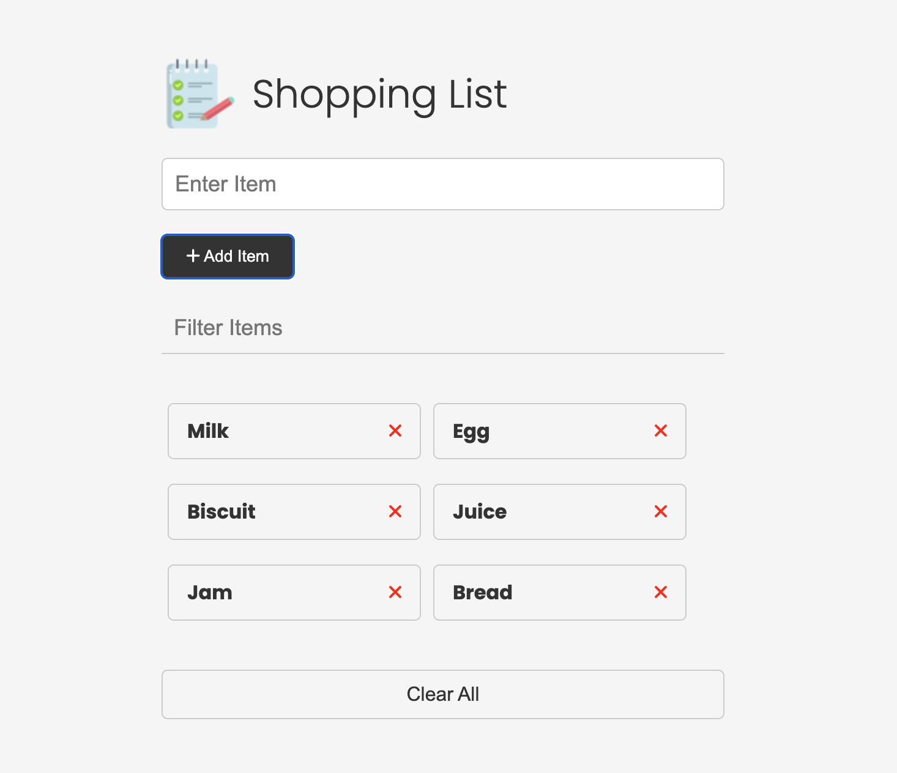

# Shopping List Web App

A simple, responsive shopping list web application built with HTML, CSS, and JavaScript. Add, remove, filter, and clear items from your shopping list with a clean and modern UI.

## Features
- Add items to your shopping list
- Remove individual items
- Filter items in real-time
- Clear all items at once
- Responsive design for mobile and desktop

## Usage
1. Open `index.html` in your browser.
2. Use the input field to add new items.
3. Use the filter box to search for items in your list.
4. Remove items by clicking the red cross next to each item.
5. Click "Clear All" to remove all items from the list.

## Project Structure
- `index.html` – Main HTML file
- `style.css` – Stylesheet for layout and design
- `script.js` – JavaScript for app functionality
- `images/` – Image assets (e.g., note.png)

## Screenshots

## License
This project is open source and free to use.
